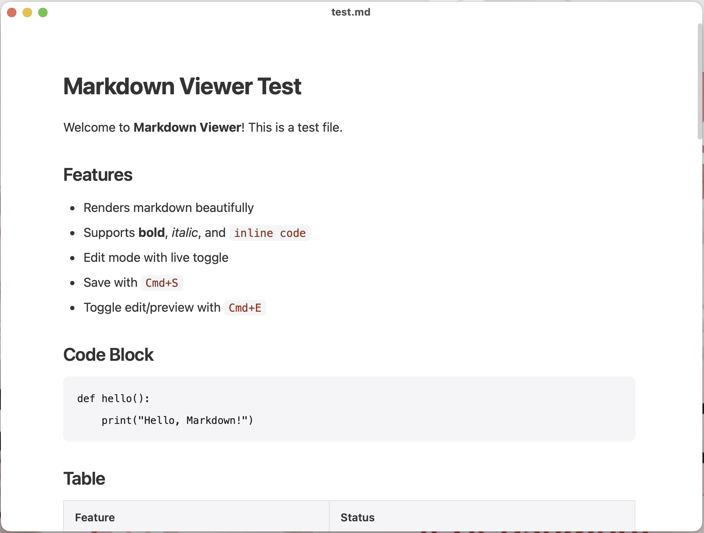

# mdPreview — A Minimal Markdown Viewer & Editor for macOS

<div align="center">

**Open, read, edit, and export Markdown files on Mac — with a clean, distraction-free interface.**

[Download mdPreview for macOS](https://github.com/tahoeliu/mdPreview/releases/latest/download/mdPreview.dmg)

</div>

---

## The easiest way to open `.md` files on Mac

Markdown files are everywhere now: AI chat exports, product notes, README files, technical docs, meeting summaries, research notes, and personal knowledge bases.

But for many people, opening a `.md` file still feels unnecessarily technical.

**mdPreview makes Markdown feel simple.**

Double-click a Markdown file and read it in a beautiful native macOS window — no browser, no account, no setup, no heavy editor.

<div align="center">
  
</div>

---

## Why mdPreview?

### Minimal by design

mdPreview is built around one idea:

> Your document should be the focus, not the app.

The interface stays quiet and clean. No side panels unless you need them. No workspace setup. No project management. No account login. No visual clutter.

Just open a Markdown file and read.

### Made for non-technical users

You do not need to understand Markdown syntax to use mdPreview.

If someone sends you a `.md` file, or if you export a response from ChatGPT, Claude, Gemini, or another AI tool, mdPreview lets you open it like a normal document.

### Useful when you need more

When reading is not enough, mdPreview also lets you edit, search, navigate long documents, and export your file into formats that are easier to share.

---

## What you can do with mdPreview

| Need | What mdPreview does |
|---|---|
| Open a `.md` file | Double-click and read it instantly |
| Read long documents | Use the built-in outline / table of contents |
| Edit content | Switch between preview and source editing |
| Share with others | Export to PDF, Word, PNG, HTML, plain text, or Markdown |
| Read AI-generated Markdown | Open ChatGPT / Claude-style Markdown exports cleanly |
| Work offline | No internet connection required |
| Keep things private | No login, no tracking, no cloud upload |

---

## Highlights in the latest version

mdPreview has recently become more useful, safer, and more comfortable for everyday writing and reading.

### Cleaner reading experience

- Minimal macOS-style interface
- Better typography for long-form reading
- Dark Mode support
- Adjustable text size with keyboard shortcuts
- A collapsible outline for long documents

### Better editing workflow

- One-click switch between rendered preview and Markdown source
- Unsaved-change indicator in the window title
- Autosaved drafts to help recover work after unexpected quits
- Safer save behavior designed to avoid accidental data loss

### More export options

Export your Markdown document as:

- PDF
- Word document
- PNG image
- Web page
- Plain text
- Markdown

This makes mdPreview useful not only for reading Markdown, but also for sharing documents with people who do not use Markdown.

### Better support for modern Markdown

mdPreview supports common Markdown features including:

- Headings
- Lists
- Tables
- Links and images
- Code blocks
- Blockquotes
- Mermaid diagrams
- Footnotes
- Inline and block-style math text
- Front matter

### Safer rendering

Markdown files can contain HTML and diagrams. mdPreview includes safer rendering behavior for risky content, including additional cleanup around embedded HTML and Mermaid output.

The goal is simple: open Markdown files with less worry.

---

## Download & install

### 1. Download

[Download mdPreview.dmg](https://github.com/tahoeliu/mdPreview/releases/latest/download/mdPreview.dmg)

### 2. Install

Open the `.dmg` file and drag **mdPreview** into your **Applications** folder.

### 3. Open it the first time

Because mdPreview is an open-source app and may not be signed with an Apple Developer certificate, macOS may show a security warning the first time you open it.

To open it:

1. Go to **Applications**
2. Right-click **mdPreview**
3. Choose **Open**
4. Click **Open** again in the dialog

You only need to do this once.

---

## Make mdPreview the default app for Markdown files

If you want every `.md` file to open with mdPreview:

1. Find any `.md` file in Finder
2. Right-click it and choose **Get Info**
3. Find **Open with**
4. Select **mdPreview**
5. Click **Change All...**

Now Markdown files will open in mdPreview by default.

---

## Keyboard shortcuts

| Shortcut | Action |
|---|---|
| `⌘ N` | New file |
| `⌘ S` | Save |
| `⌘ ⇧ S` | Save As / Export |
| `⌘ E` | Switch between preview and source |
| `⌘ F` | Find |
| `⌘ G` | Find next |
| `⌘ ⇧ G` | Find previous |
| `⌘ =` | Increase text size |
| `⌘ -` | Decrease text size |
| `⌘ ⌥ O` | Toggle outline |
| `⌘ P` | Print |

---

## Who is mdPreview for?

mdPreview is a good fit if you:

- Receive Markdown files but do not want to open a code editor
- Save AI-generated answers as `.md` files
- Want a lightweight Typora or MacDown alternative
- Need a simple Markdown reader for macOS
- Prefer offline tools
- Like clean, minimal interfaces
- Want a free and open-source app

It is intentionally not a full writing studio, project manager, or IDE.

It is a focused Markdown viewer and editor.

---

## mdPreview vs other Markdown apps

| Feature | mdPreview | Typora | MacDown | Bear | VS Code |
|---|:---:|:---:|:---:|:---:|:---:|
| Free | Yes | No | Yes | Limited | Yes |
| Open source | Yes | No | Yes | No | Yes |
| Minimal UI | Yes | Yes | Partial | Yes | No |
| Double-click `.md` files | Yes | Yes | Yes | Yes | Requires setup |
| Works offline | Yes | Yes | Yes | Partial | Yes |
| No account required | Yes | Yes | Yes | No | Yes |
| Lightweight | Yes | Partial | Yes | Yes | No |
| Edit and preview | Yes | Yes | Yes | Yes | Requires extensions |
| Mermaid support | Yes | Partial | No | No | Requires extensions |
| Export options | Yes | Yes | Limited | Limited | Requires extensions |

---

## Privacy

mdPreview runs locally on your Mac.

- No account
- No ads
- No telemetry
- No cloud sync
- No document upload
- No internet required for normal use

Your Markdown files stay on your computer.

---

## FAQ

### What is mdPreview?

mdPreview is a free, open-source Markdown viewer and editor for macOS. It lets you open, read, edit, and export `.md` files in a clean native Mac interface.

### Do I need to know Markdown?

No. You can use mdPreview simply as a reader. If you want to edit the source text, you can switch to edit mode anytime.

### Is mdPreview free?

Yes. mdPreview is free and open source under the MIT License.

### Does it work offline?

Yes. mdPreview works offline and does not require an account.

### Why does macOS say the app cannot be opened?

macOS may warn you because the app is open source and may not be signed with an Apple Developer certificate. Right-click the app, choose **Open**, then confirm. You only need to do this once.

### Can I export Markdown to PDF or Word?

Yes. mdPreview supports exporting Markdown documents to PDF, Word, PNG, HTML, plain text, and Markdown.

### Is this a replacement for VS Code?

Not exactly. VS Code is a full development environment. mdPreview is for people who want a simple, focused way to read and edit Markdown files.

---

## For developers

mdPreview is built with:

- Python 3.13+
- pywebview
- WKWebView on macOS
- marked.js
- Mermaid
- Native macOS menus and file dialogs

### Build from source

```bash
pip install pywebview
./build.sh
./install.sh
```

### Project structure

```text
MarkdownViewer/
├── markdown_viewer.py    # Python app, window, menu, and file APIs
├── index.html            # WebView shell
├── styles.css            # App styles
├── app.js                # Editor, rendering, search, export, and bridge logic
├── marked.min.js         # Markdown renderer
├── turndown.js           # HTML to Markdown converter
├── mermaid.min.js        # Mermaid diagram support
├── app_icon.icns         # Application icon
├── Info.plist            # macOS app metadata
├── VERSION               # App version
├── build.sh              # Build script
├── install.sh            # Local install script
└── README.md
```

---

## Contributing

Contributions are welcome.

You can help by:

- Reporting bugs
- Suggesting improvements
- Improving documentation
- Testing new releases
- Opening pull requests

Please use [GitHub Issues](https://github.com/tahoeliu/mdPreview/issues) for bug reports and feature requests.

---

## License

mdPreview is released under the MIT License.

See [LICENSE](LICENSE) for details.

---

<div align="center">

**A minimal Markdown app for people who just want to read the file.**

Made by [Tahoe Liu](https://github.com/tahoeliu)

[Download mdPreview](https://github.com/tahoeliu/mdPreview/releases/latest/download/mdPreview.dmg) · [Back to top](#mdpreview--a-minimal-markdown-viewer--editor-for-macos)

</div>

---

**Keywords:** macOS Markdown viewer, Markdown reader for Mac, free Markdown editor for Mac, minimal Markdown app, open .md files on Mac, AI Markdown viewer, ChatGPT Markdown viewer, Claude Markdown export, Typora alternative, MacDown alternative, open source Markdown viewer, Mermaid Markdown viewer
