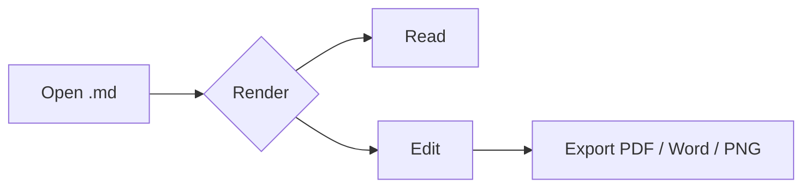

# mdPreview — Feature Tour

> A self-rendering tour of everything **mdPreview** can display.
> Open this file in mdPreview, then screenshot the window for the README.

---

## 1. Typography & Text

mdPreview renders **bold**, *italic*, ***combined***, and ~~strikethrough~~ text,
inline `code`, and [links](https://github.com/tahoeliu/mdPreview).

中文排版也能正常显示：一键打开 Markdown，阅读更轻松。CJK 字体、标点与混排均无压力。

---

## 2. Heading Scale

### H3 heading
#### H4 heading
##### H5 heading
###### H6 heading

---

## 3. Lists

- Unordered item
  - Nested item
  - Another nested item
- Back to top level

1. Ordered step one
2. Ordered step two
   1. Sub-step
3. Ordered step three

- [x] Completed task
- [ ] Pending task

---

## 4. Tables

| Feature | Supported | Notes |
| :--- | :---: | ---: |
| Headings | ✅ | H1 – H6 |
| Tables | ✅ | Alignment aware |
| Code | ✅ | Syntax highlight |
| Math | ✅ | Inline & block |
| Mermaid | ✅ | Diagrams |
| Footnotes | ✅ | Bottom notes |

---

## 5. Code Blocks

```python
def greet(name: str) -> str:
    """Render a friendly greeting."""
    return f"Hello, {name}!"

print(greet("mdPreview"))
```

---

## 6. Blockquotes

> "Your document should be the focus, not the app."
>
> — mdPreview philosophy

---

## 7. Mermaid Diagrams



---

## 8. Math

Inline math like $E = mc^2$ renders inline with the text.

Block math:

$$
\int_{0}^{\infty} e^{-x^2}\,dx = \frac{\sqrt{\pi}}{2}
$$

---

## 9. Footnotes

mdPreview supports footnotes, which appear at the bottom of the document.¹

---

## 10. Images


---

## 11. Horizontal Rules & More

A horizontal rule separates sections, as seen above. Combine all of the above —
headings, tables, code, quotes, diagrams, math, footnotes, and images — in one
document, and mdPreview's collapsible outline (⌘⌥O) will let you navigate it all.

¹ A footnote appears here at the bottom of the document.
