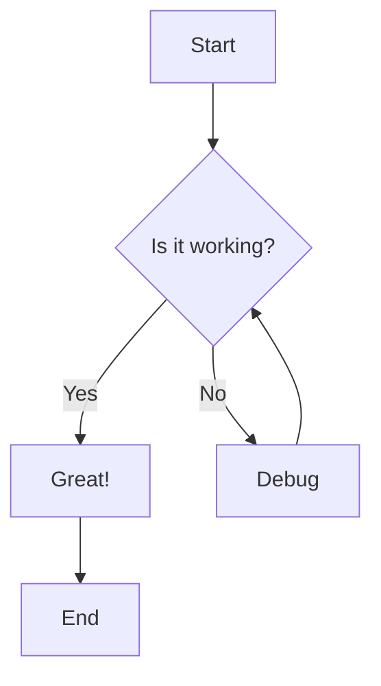
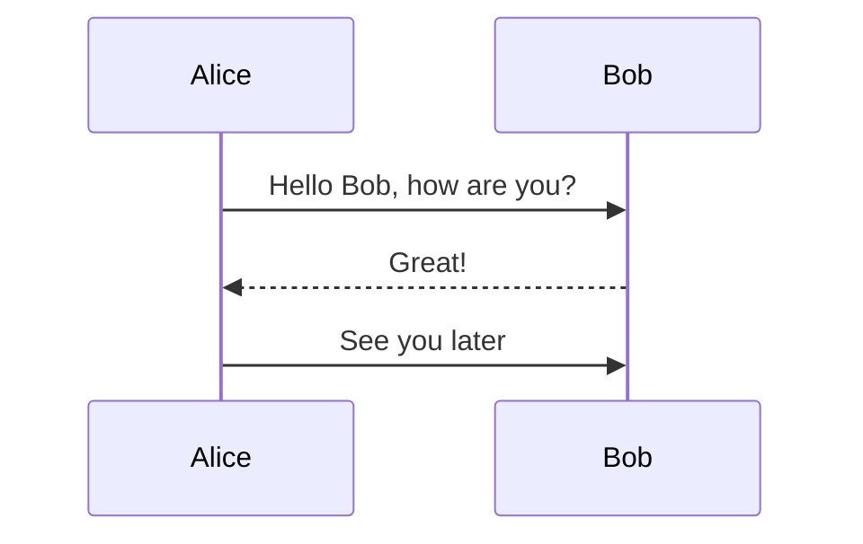

# Markdown Viewer Test

Welcome to **Markdown Viewer**! This is a test file.

## Features

-   Renders markdown beautifully
-   Supports **bold**, *italic*, and `inline code`
-   Edit mode with live toggle
-   Save with `Cmd+S`
-   Toggle edit/preview with `Cmd+E`

## Code Block

```python
def hello():
    print("Hello, Markdown!")
```

## Table

Feature

Status

Render

✅

Edit

✅

Save

✅

> This is a blockquote. It looks clean and minimal.

## Links

Visit [GitHub](https://github.com) for more info.

* * *

That's it! Try pressing `Cmd+E` to edit this file.

## Flowchart Test



### Sequence Diagram

