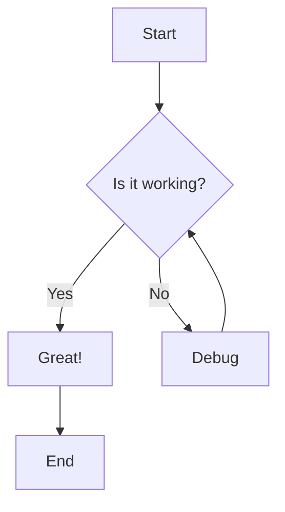
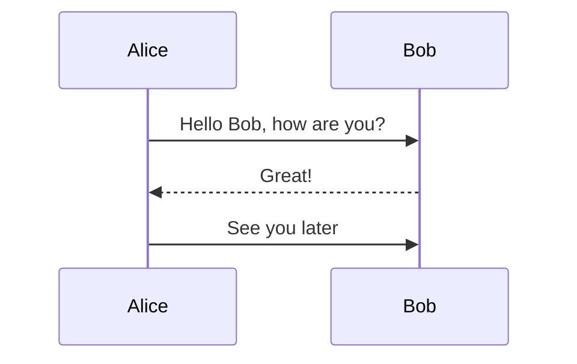

# Markdown Viewer Test

Welcome to **Markdown Viewer**! This is a test file.

## Features

-   Renders markdown beautifully
-   Supports **bold**, *italic*, and `inline code`
-   Edit mode with live toggle
-   Save with `Cmd+S`
-   Toggle edit/preview with `Cmd+E`

## Code Block

```python
def hello():
    print("Hello, Markdown!")
```

## Table

| Feature | Status |
|---------|--------|
| Render | ✅ Done |
| Edit | ✅ Done |
| Save | ✅ Done |
| Flowchart | ✅ Done |
| Properties | ✅ New |
| Table Balancing | ✅ New |

### Wider Table (Column Balancing Test)

| Name | Description | Category | Priority | Status |
|------|-------------|----------|----------|--------|
| Markdown Rendering | Render markdown content with full GFM support including tables, lists, and code blocks | Core | P0 | Complete |
| Cmd+E Toggle | Switch between rendered preview and source editing mode with cursor sync | Core | P0 | Complete |
| Mermaid Diagrams | Render flowchart, sequence diagram, class diagram, and other diagram types | Feature | P1 | Complete |
| File Properties | Show file name, location, size, and modification date in a modal dialog | Core | P1 | Complete |
| Column Balancing | Auto-balance table column widths based on content for even text wrapping | Feature | P2 | In Progress |

> This is a blockquote. It looks clean and minimal.

## Links

Visit [GitHub](https://github.com) for more info.

* * *

That's it! Try pressing `Cmd+E` to edit this file.

## Flowchart Test



### Sequence Diagram

