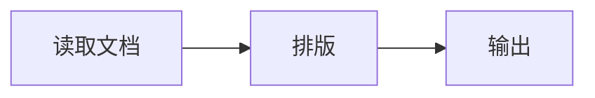
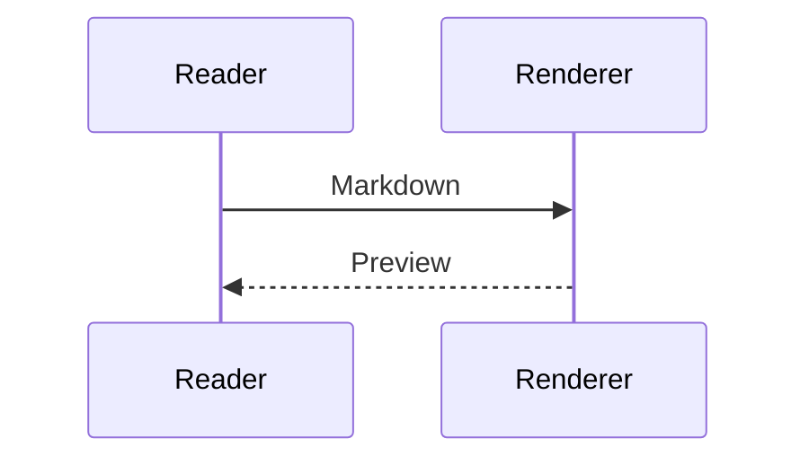

# Mermaid 流程与时序

```mermaid
flowchart LR
 A[读取文档] --> B[排版] --> C[输出]
```

```mermaid
sequenceDiagram
 participant Reader
 participant Renderer
 Reader->>Renderer: Markdown
 Renderer-->>Reader: Preview
```
